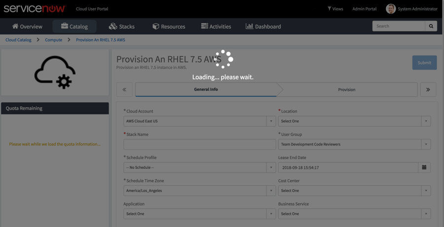

## Custom Loading Spinner for Cloud User Portal
###### Solution Category: Enhancement
Display a more visibly prominent loading spinner when processing pages on the Cloud User Portal so that end users are aware that the form is being processed/loaded.  The intent is to augment the visibility of the OOB (out-of-the-box) spinner (i.e. three dots (“…”)) in the header.

## ServiceNow Release

This solution was initially created on Kingston Patch 6.

## Prerequisites

Jakarta and above Cloud Management (CMP V2) application is activated.

## Installation Steps

There is one update set to:

1. Create a widget that contains just the custom spinner.
2. Add the widget to the OOB “Cloud Catalog Item” Service Portal page.

Once the update set has been applied, a loading spinner will appear during the form load event on the Cloud User Portal.

Filename: Custom Loading Spinner_UpdateSet_vNN.xml

## Documentation

Refer to the Custom Loading Spinner_HowToSteps_vNN.pdf document as additional how-to reference on manually configuring this solution.

###### Screenshot of Loading Spinner

## Disclaimer
This is not an officially supported solution by ServiceNow.

## Authors

* Annie Chan
* Pat Paluri

## Maintainers/Sponsors

Current maintainers:

* [Annie Chan](https://github.com/sn-achan)
